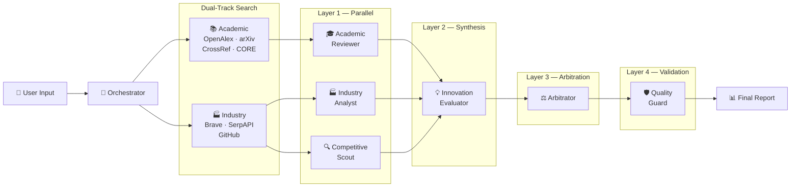

<p align="center">
  
</p>

<h1 align="center">Novoscan</h1>

<p align="center">
  <a href="./LICENSE"></a>
  <a href="https://github.com/Joe7921/Novoscan/actions/workflows/ci.yml"></a>
  
</p>

<h3 align="center"><em>5 AI experts collaborate to verify if your innovation already exists.</em></h3>

<p align="center">
  <code>7 data sources</code> ×
  <code>5 specialized agents</code> ×
  <code>1 arbitrator</code>
</p>

<p align="center">
  <a href="https://novoscan.cn"></a>&nbsp;
  <a href="#-docker-quick-start"></a>&nbsp;
  <a href="https://github.com/Joe7921/Novoscan/discussions"></a>
</p>

<p align="center">
  <!-- TODO: Replace with a recorded GIF demo -->
  
</p>

---

## ✨ Features

### 🤖 Multi-Agent Collaboration (5 + 1 + 1)

Unlike single-model Q&A, Novoscan runs a full **multi-agent decision pipeline**:

| Agent | Role |
|-------|------|
| 🎓 **Academic Reviewer** | Deep-dive into scholarly literature, assess theoretical foundations |
| 🏭 **Industry Analyst** | Evaluate market landscape, commercialization potential & trends |
| 🔍 **Competitive Scout** | Reverse-engineer competitor tech stacks, find differentiation gaps |
| 💡 **Innovation Evaluator** | Cross-examine all Layer 1 reports, deliver independent judgment |
| ⚖️ **Arbitrator** | Dynamically weight scores, resolve conflicts, produce final verdict |
| 🛡️ **Quality Guard** | Pure logic validation — scoring consistency & evidence completeness |

### 🔬 Dual-Track Search Engine — 7 Data Sources

| Track | Sources |
|-------|---------|
| **Academic** | OpenAlex · arXiv · CrossRef · CORE |
| **Industry** | Brave Search · SerpAPI · GitHub API |

### ⚡ Ecosystem Modules

- ⚡ **Novoscan Flash** — Express mode, results in 10–20 seconds
- 🌐 **NovoDiscover** — Cross-domain innovation exploration via analogical reasoning
- 🔄 **NovoDebate** — Adversarial debate engine
- 🧬 **NovoDNA** — Innovation genome mapping
- 🧪 **NovoMind** — Conversational innovation personality assessment
- 📡 **NovoTracker** — Trend monitoring + Webhook push
- 🔌 **MCP Remote Service** — Direct invocation from Claude / Cursor / ChatGPT

### 🏢 Three Business Modules

| Module | Description |
|--------|-------------|
| 🔬 **Novoscan** | AI academic + industry innovation check, 5+1+1 multi-agent pipeline |
| 💼 **Bizscan** | AI startup idea commercial feasibility assessment |
| ⚙️ **Clawscan** | Skill / resume innovation evaluation |

---

## 🚀 Quick Start

### ⚡ 30-Second Experience (Zero API Keys!)

```bash
git clone https://github.com/Joe7921/Novoscan.git
cd Novoscan
npm install
npm run setup   # Auto-creates .env.local with Mock AI ON
npm run dev
```

🎉 Open [http://localhost:3000](http://localhost:3000) — **no API keys needed!** Mock AI mode provides a full end-to-end experience with high-quality simulated data.

---

### 🌐 One-Click Cloud Experience (Zero Install!)

[](https://codespaces.new/Joe7921/Novoscan?quickstart=1)
[](https://gitpod.io/#https://github.com/Joe7921/Novoscan)

> Browser-based IDE with auto-setup. Opens `http://localhost:3000` within 60 seconds!

**Or quick clone without Git history:**
```bash
npx degit Joe7921/Novoscan my-novoscan && cd my-novoscan
npm install && npm run setup
npm run dev
```

---

### ☁️ Option A: Try Online (Zero Setup)

Head to **[novoscan.cn](https://novoscan.cn)** — sign up free and start scanning instantly.

---

### 🐳 Option B: Docker Quick Start

```bash
git clone https://github.com/Joe7921/Novoscan.git
cd Novoscan
docker compose up -d
```

Open [http://localhost:3000](http://localhost:3000) — that's it!

---

### 💻 Option C: Local Development

#### Prerequisites

- **Node.js** ≥ 18.17.0
- **npm** / **yarn** / **pnpm**

```bash
git clone https://github.com/Joe7921/Novoscan.git
cd Novoscan
npm install
npm run setup   # Auto-creates .env.local (Mock AI ON, no keys needed)
npm run dev
```

Open [http://localhost:3000](http://localhost:3000) to start developing.

Build for production:

```bash
npm run build && npm start
```

---

## 🏗️ Architecture



> For full architecture details, see [docs/architecture.md](docs/architecture.md).

---

## 🛠️ Tech Stack

| Category | Technology |
|----------|------------|
| **Framework** | Next.js 14 (App Router) + React 18 |
| **Language** | TypeScript 5 |
| **Styling** | Tailwind CSS 3 + Framer Motion |
| **Charts** | Recharts |
| **AI Models** | MiniMax / DeepSeek V3 & R1 / Moonshot (Kimi) |
| **Local Storage** | IndexedDB (Dexie.js) + localStorage |
| **Database** | PostgreSQL (Docker) / Supabase (Cloud) |
| **Testing** | Vitest + Mock AI mode |
| **MCP Protocol** | mcp-handler + @modelcontextprotocol/sdk |
| **Icons** | Lucide React |
| **Deployment** | Vercel / Docker / Self-hosted |

---

## 🧩 Plugin Development — Write Your First Agent in 15 Lines

Novoscan features a powerful **plugin system** that lets you create custom analysis Agents:

```bash
# Generate a new Agent plugin with interactive CLI
npm run create-agent
```

Or create one manually — it's just 15 lines of TypeScript:

```typescript
import { defineAgent } from '@/plugins/types'

export default defineAgent({
  id: 'my-agent',
  name: 'My Agent',
  nameEn: 'My Agent',
  description: 'Custom analysis logic',
  version: '1.0.0',
  category: 'community',
  icon: '🤖',
  async analyze(input) {
    // Your analysis logic here
    return { agentName: 'My Agent', score: 75, /* ... */ }
  }
})
```

📖 Full plugin development guide: [src/plugins/README.md](src/plugins/README.md)

### 🧪 Built-in Example Plugins

| Plugin | Description |
|--------|-------------|
| 📜 **Patent Scout** | Search global patent databases, assess overlap |
| 📈 **GitHub Trends** | Analyze open source ecosystem trends |
| 🔬 **arXiv Scanner** | Scan frontier academic papers for innovation space |

---

## 🛠️ Developer Tools

| Tool | URL | Description |
|------|-----|-------------|
| 🧩 **Agent Playground** | `/playground` | Interactively test any registered Agent plugin |
| 🏪 **Plugin Marketplace** | `/marketplace` | Browse, search, and install community plugins |
| 🛠️ **Dev Dashboard** | `/dev` | View plugin registry, health status, environment config |
| 📖 **Documentation** | `/docs` | Full architecture and API documentation |
| 🏥 **Health Check** | `/health` | API data source connectivity test |

---

## 🤝 Contributing

Contributions of all kinds are welcome! See [CONTRIBUTING.md](./CONTRIBUTING.md) for guidelines.

- 🐛 [Report a Bug](../../issues/new?template=bug_report.md)
- ✨ [Request a Feature](../../issues/new?template=feature_request.md)
- 🧩 Build a Plugin — `npm run create-agent`
- 📖 Improve Documentation
- 💻 Submit a Pull Request

---

## 💖 Sponsors

If Novoscan helps you, consider supporting us via [GitHub Sponsors](https://github.com/sponsors/Joe7921)!

See [SPONSORS.md](./SPONSORS.md) for details.

---

## 📄 License

Licensed under the [Apache License 2.0](./LICENSE).

Copyright 2024–2026 [Halfsense (半直觉)](https://github.com/Joe7921)

---

<details>
<summary>🇨🇳 中文文档 (Chinese Documentation)</summary>

## 📖 项目简介

**Novoscan** 是一款专注于 **"创新点查重"** 垂直领域的 AI Agent 产品。它摒弃了传统的单线程关键词搜索和字面匹配式查重，通过底层的**多智能体协同工作流（Multi-Agent Workflow）**，从学术文献、产业竞品、开源生态三个维度，对用户的创新想法进行**多维度深度交叉验证**，最终输出一份带有量化评分、证据溯源、风险提示和行动建议的结构化创新力评估报告。

### 🏢 三大业务板块

| 板块 | 说明 |
|------|------|
| 🔬 **Novoscan** | AI 学术 + 产业创新查重，5+1+1 多 Agent 协同决策 |
| 💼 **Bizscan** | AI 创业想法商业可行性综合评估 |
| ⚙️ **Clawscan** | 技能 / 履历创新性检验与评估 |

### 🤖 五位专家 + 仲裁员的多智能体协同

不同于传统单一模型问答，Novoscan 内建了一套完整的 **5+1+1 多智能体协同决策体系**：

| 角色 | 职责 |
|------|------|
| 🎓 **学术审查员** | 深度分析学术检索数据，评估技术学术基础 |
| 🏭 **产业分析员** | 分析产业检索数据，评估市场格局与商业化前景 |
| 🔍 **竞品侦探** | 拆解竞品技术栈、市场策略，寻找差异化突破口 |
| 💡 **创新评估师** | 综合 Layer1 报告，进行交叉质疑与独立判断 |
| ⚖️ **仲裁员** | 动态调整权重，解决分歧，给出最终加权决策 |
| 🛡️ **质量守卫** | 纯逻辑校验，检查评分一致性与证据完整性 |

**执行拓扑**：

```
Layer 1（并行）：学术审查员 → 产业分析员 → 竞品侦探 → 跨域侦察兵
Layer 2（串行）：创新评估师 → 接收全部 Layer1 输出，交叉审查
Layer 3（串行）：仲裁员 → 加权评分，解决冲突
Layer 4（同步）：质量守卫 → 纯逻辑校验
```

### 🔬 双轨检索引擎：7 个数据源

**学术轨道**：OpenAlex · arXiv · CrossRef · CORE

**产业轨道**：Brave Search · SerpAPI · GitHub API

### 🌟 生态模块

- ⚡ **Novoscan Flash** — 极速降维模式，10~20 秒出结果
- 🌐 **NovoDiscover** — 跨域创新探索（类比推理）
- 🔄 **NovoDebate** — 对抗性辩论引擎
- 🧬 **NovoDNA** — 创新基因图谱
- 🧪 **NovoMind** — 对话式创新人格评测
- 📡 **NovoTracker** — 趋势监控 + Webhook 推送
- 🔌 **MCP 远程服务** — Claude/Cursor/ChatGPT 直接调用

### 🚀 快速开始

#### 前置条件

- **Node.js** >= 18.17.0
- **npm** / **yarn** / **pnpm**

#### 1. 克隆与安装

```bash
git clone https://github.com/Joe7921/novoscan.git
cd novoscan
npm install
```

#### 2. 初始化环境变量

```bash
npm run setup   # 自动创建 .env.local，Mock AI 模式已开启
```

> 🎉 **无需任何 API Key！** Mock AI 模式提供完整的端到端体验。
> 准备接入真实 AI？编辑 `.env.local`，将 `MOCK_AI` 改为 `false` 并填入密钥。

#### 3. 启动开发服务器

```bash
npm run dev
```

浏览器打开 [http://localhost:3000](http://localhost:3000) 即可体验。

#### 4. 构建生产版本

```bash
npm run build
npm start
```

### ☁️ 云端托管服务

不想自己部署？直接使用我们的在线版本：

🌐 **[novoscan.cn](https://novoscan.cn)** — 免费注册，即刻体验

云端托管版提供：
- 🔄 自动更新至最新版本
- ☁️ 云端历史记录同步
- ⚡ 全球 CDN 加速
- 🛡️ 企业级安全保障

### 💡 创意来源

> *"为了不再重复造轮子"*

Novoscan 的诞生源自于日常开发与学术研究中真切遭遇的痛点 — 验证一个"创新点子"是否已被实现的成本实在太高。它致力于让每一次"灵感顿悟"都以最高效的方式得到回应。

</details>
