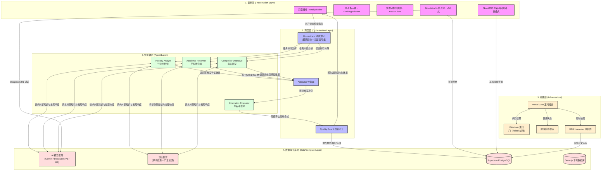
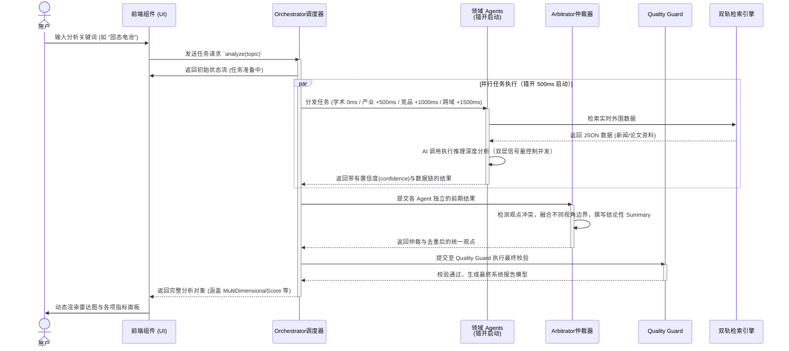
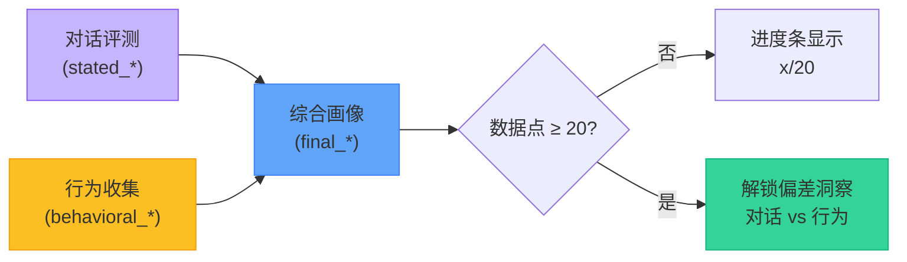

# 架构设计与数据流 (Architecture & Data Flow)

本文档详细描述 Novoscan-Next 的多智能体协作架构、核心技术栈以及数据流向。

## 1. 核心技术栈
- **前端框架**: Next.js 14, React 18, Tailwind CSS, Framer Motion
- **AI基座**: Google Gemini API (`@google/genai`) / DeepSeek V3 / DeepSeek R1
- **外部数据源**: 
  - **学术四源**: OpenAlex / arXiv / CrossRef / CORE
  - **产业三源**: Brave Search / SerpAPI / GitHub API
- **本地存储**: Dexie.js (IndexedDB) 用于持久化 Agent 执行记录与分析历史报告
- **云端存储**: Supabase PostgreSQL 用于创新点、API 日志、用户认证、NovoMind 评测结果
- **定时任务**: Vercel Cron（Tracker 扫描 / DNA 收割 / CaseVault）+ Webhook 通知

## 2. 核心架构图
系统采用四层分层架构设计，确保表现层 UI、Agent 调度逻辑以及底层计算源的完全解耦。



## 3. Agent 协作时序图

以下时序图展示了一个完整的深度分析任务从用户发起到前端渲染的闭环完整周期：



## 4. AI 并发控制架构

```
┌──────────────────────────────────────────────────┐
│                  AI 调用入口 (callAIRaw)          │
│                                                    │
│   priority='high'          priority='low'          │
│        ↓                        ↓                  │
│  ┌────────────┐          ┌────────────┐            │
│  │ 主信号量    │          │ 低优先级    │            │
│  │ max = 3    │          │ 信号量      │            │
│  │            │          │ max = 1    │            │
│  │ Agent 专用  │          │ NovoDNA    │            │
│  └────────────┘          └────────────┘            │
│        ↓                        ↓                  │
│  ┌─────────────────────────────────────────────┐   │
│  │     AbortSignal 深度集成                      │   │
│  │  - 被取消的 Agent 自动从等待队列移除            │   │
│  │  - 429/503 → 解析 Retry-After → 等待后重试    │   │
│  │  - 模型降级链：Gemini → DeepSeek → 重试       │   │
│  └─────────────────────────────────────────────┘   │
└──────────────────────────────────────────────────┘
## 5. NovoMind 三代理架构

NovoMind 采用三个独立代理协作完成人格评测：

```
┌────────────────────────────────────────────────────────────────────┐
│                     NovoMind 三代理架构                            │
│                                                                    │
│  ┌──────────────┐                                                  │
│  │  访谈代理     │◄──── DeepSeek R1 (reasoning_content 内心独白)   │
│  │  Interviewer  │                                                  │
│  │  • V4 灵活版  │  ────► 对话消息 (5-15轮)                        │
│  │  • 动态深度   │                                                  │
│  │  • 五维覆盖   │                                                  │
│  └──────┬───────┘                                                  │
│         │                                                          │
│         │ [ASSESSMENT_READY] 或用户点击生成报告                     │
│         │                                                          │
│         ▼                                                          │
│  ┌──────────────┐     ┌──────────────┐                             │
│  │  BARS 评估    │     │  IDEA 评估    │  ◄── 并行执行              │
│  │  代理         │     │  代理         │                             │
│  │              │     │              │                             │
│  │  五维量化评分 │     │  四维人格画像 │                             │
│  │  1.0 - 5.0   │     │  0 - 100     │                             │
│  └──────┬───────┘     └──────┬───────┘                             │
│         │                    │                                     │
│         ▼                    ▼                                     │
│  ┌──────────────┐     ┌──────────────┐                             │
│  │ novomind_    │     │ user_idea_   │                             │
│  │ assessments  │     │ profile      │                             │
│  │ (BARS结果)   │     │ (IDEA画像)   │                             │
│  └──────────────┘     └──────┬───────┘                             │
│                              │                                     │
│                    行为信号持续收集                                  │
│                              │                                     │
│                              ▼                                     │
│                       ┌──────────────┐                             │
│                       │ 偏差洞察引擎 │ ◄── 20个数据点后解锁        │
│                       │ Divergence   │                             │
│                       │ 对话 vs 行为 │                             │
│                       └──────────────┘                             │
└────────────────────────────────────────────────────────────────────┘
```

### 画像进化流程



### BARS 五维评估维度

| 维度 | Key | 评估内容 | 分数范围 |
|------|-----|---------|---------|
| 认知开放度 | `cognitive_openness` | 兴趣广度、对新事物的态度 | 1.0 - 5.0 |
| 破局重构力 | `paradigm_breaking` | 挑战现状、重新定义规则 | 1.0 - 5.0 |
| 模糊容忍度 | `ambiguity_tolerance` | 不确定性下的决策能力 | 1.0 - 5.0 |
| 创新内驱力 | `intrinsic_motivation` | 内在驱动力强度 | 1.0 - 5.0 |
| 落地执行力 | `execution_capability` | 想法到落地的能力 | 1.0 - 5.0 |

### 综合分数融合策略

IDEA 画像的综合分数（`final_*`）采用加权融合：

```
behaviorWeight = min(0.5, dataPoints × 0.025)   // 每个行为点+2.5%, 上限50%
statedWeight   = 1 - behaviorWeight

final_score = statedWeight × stated_score + behaviorWeight × behavioral_score
```

### 数据库表结构

| 表名 | 用途 | 关键字段 |
|------|------|---------|
| `novomind_assessments` | BARS 五维评测结果 | `user_id`, `dimensions`, `overall_innovation_index` |
| `user_idea_profile` | IDEA 四维画像 | `stated_*`, `behavioral_*`, `final_*`, `divergence_unlocked`, `divergence_report` |

## 6. 关键数据流与异常处理

1. **状态流转与透明化**：前端 UI 通过接收 Orchestrator 传递的节点状态流（如：`working`, `completed`, `error`），交由 `ThinkingIndicator` 组件呈现 Agent 当下的工作状态，确保分析过程的用户心智透明化。各 Agent 完成后即时展示摘要预览（评分 + 核心发现）。
2. **持久化存储记录**：分析流完毕后，系统通过 Dexie.js 将最终报告结构体写入 IndexedDB 的 `execution_history` 存储中，保证页面刷新不丢失分析历史。NovoMind 评测结果持久化至 Supabase `novomind_assessments` 表。
3. **容错与全面超时机制**：为防止单点阻塞，Agent 执行层具备超时容错的 `runWithTimeout` 控制。全局分析默认在设定时间内熔断。超时后，系统将依据当下阶段自动截取已完成节点内容，并返回 `isPartial: true` 的标志性数据，确保系统在高压或网络阻塞下不发生"白屏死亡"，而是展现出平稳的降级处理结果。
4. **错开启动与限流保护**：Layer1 的 4 个 Agent 以 500ms 间隔错开启动，避免瞬时并发触发 AI API 限流。配合 429/503 智能退避机制，显著提升大负载下的成功率。
5. **Cron 健康监控**：`/api/tracker/health` 端点实时报告 Cron 执行状态（`healthy` / `degraded` / `critical`），检测过期和错过 48h+ 的监控任务，为运维提供可观测性。Cron 执行后通过 Webhook 自动推送结果。
